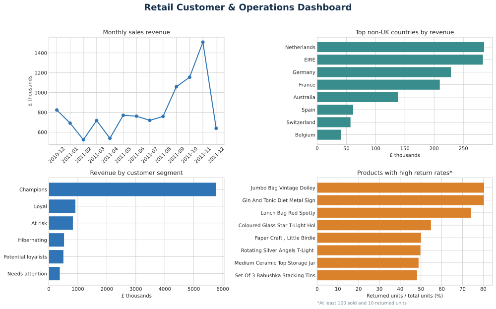

# Retail Customer & Operations Analytics



This project answers a practical retail question:

> Where is the business earning revenue, which customers need attention, and which products may be creating avoidable returns?

I built a reproducible Python and SQL pipeline, a small interactive dashboard, and an executive report. The focus is not only on charts. It is on clear metric definitions, data-quality checks and decisions a retail manager could act on.

## Business questions

1. How do sales and order value change over time?
2. Which countries contribute the most revenue outside the main UK market?
3. How concentrated is revenue among customers?
4. Which customers are loyal, at risk or inactive?
5. Which products have unusually high return rates at meaningful sales volume?

## Results

The analysis found:

- **£10.67 million** in valid sales from **19,960 orders**
- **£534** average order value
- **7.8%** cancelled/returned value rate
- **65.6%** of identified customers ordered at least twice
- the top 10% of identified customers generated **61.4%** of known-customer revenue
- **663 At risk customers** with about **£830,000** in historical sales
- **November 2011** was the strongest complete month
- **the Netherlands** was the strongest market outside the UK

These results suggest three practical priorities: target valuable At risk customers, investigate products with unusual cancellation patterns, and prepare stock and staffing ahead of the year-end sales peak. Details and limitations are in [`reports/executive_summary.md`](reports/executive_summary.md).

## What the project demonstrates

- Python: pandas, NumPy, data cleaning, aggregation and visualisation
- SQL: window functions, common table expressions and KPI queries
- Customer analytics: RFM scoring and actionable segmentation
- Business analysis: sales, average order value, market performance and returns
- Data quality: missing IDs, cancelled lines and incomplete reporting periods
- Engineering basics: modular code, automated tests and GitHub Actions
- Communication: dashboard, charts, executive summary and documented limitations

## Project structure

```text
.
├── app.py                         # Streamlit dashboard
├── data/
│   ├── README.md                  # source and licence notes
│   └── processed/                 # generated KPI tables
├── reports/
│   ├── executive_summary.md
│   └── figures/
├── sql/business_queries.sql       # five decision-focused SQL analyses
├── src/                           # download, cleaning, RFM and pipeline code
└── tests/                         # automated cleaning and RFM tests
```

## Run it locally

Python 3.11 or newer is recommended.

```bash
make setup
make analyse
make test
make dashboard
```

The pipeline downloads the source file from UCI, creates a local SQLite database, exports summary CSV files and rebuilds the figures and executive report.

Without `make`, the equivalent commands are:

```bash
python -m venv .venv
.venv/bin/pip install -r requirements.txt
.venv/bin/python -m src.pipeline
.venv/bin/python -m pytest -q
.venv/bin/streamlit run app.py
```

## Metric definitions

- **Valid sale:** positive quantity, positive unit price, known description and not a cancelled invoice.
- **Sales revenue:** sum of quantity × unit price for valid sales. This is revenue, not profit; cost data is not available.
- **Return value rate:** absolute value of cancelled lines divided by sales revenue plus cancelled value. This is a cancellation/return signal because the source does not include a reason code.
- **Average order value:** valid sales revenue divided by the number of distinct valid invoices.
- **Repeat customer:** an identified customer with at least two valid invoices.
- **RFM:** recency, frequency and monetary value scored in quintiles. Missing customer IDs are excluded only from customer analysis.

## Data source and licence

Chen, D. (2015). *Online Retail* [Dataset]. UCI Machine Learning Repository. [https://doi.org/10.24432/C5BW33](https://doi.org/10.24432/C5BW33)

The dataset is licensed under [CC BY 4.0](https://creativecommons.org/licenses/by/4.0/). The code in this repository is MIT licensed.

## Limitations

- The data describes one UK-based retailer and approximately one year of activity.
- Customer IDs are missing for part of the source data.
- No product cost, margin, inventory level or reason-for-return field is available.
- December 2011 is incomplete and should not be compared directly with full months.

## Author

Muhammad Umair Sarwar  
Incoming M.Sc. Mathematics in Data Science student at TU Darmstadt  
[LinkedIn](https://www.linkedin.com/in/muhammad-umair-sarwar) | [GitHub](https://github.com/MUmairSarwar)
